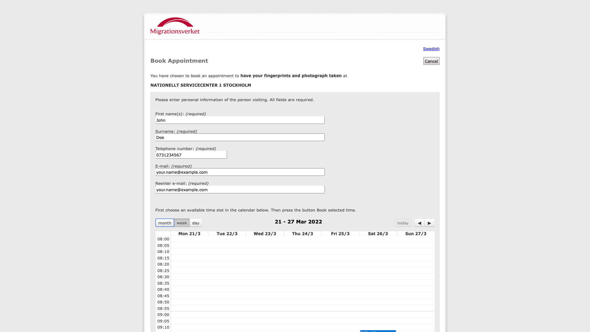

# Migrationsverket booking

Helps to book an appointment in Swedish Migration Agency (Migrationsverket) to have your fingerprints and photograph taken.

Searching for available time slots includes 3 locations:

- Stockholm (Sundbuberg)
- Uppsala
- Västerås

### Requirements

- [NodeJS](https://github.com/nodejs/node)
- [Yarn](https://github.com/yarnpkg/yarn)
- [direnv](https://github.com/direnv/direnv)

### Installation

```bash
brew install node
brew install yarn
brew install direnv
yarn install
```

### Configuration

Change the following options in [.env](.env).

```
NUMBER_OF_PERSONS=1
FIRSTNAME=John
LASTNAME=Doe
PHONE=0731234567
EMAIL=your.name@example.com
```

### Usage

```bash
node main.js
```

When timeslots are available browser will be available for 200 seconds, so that one have enough time to chose proper slot(s) and confirm booking.


